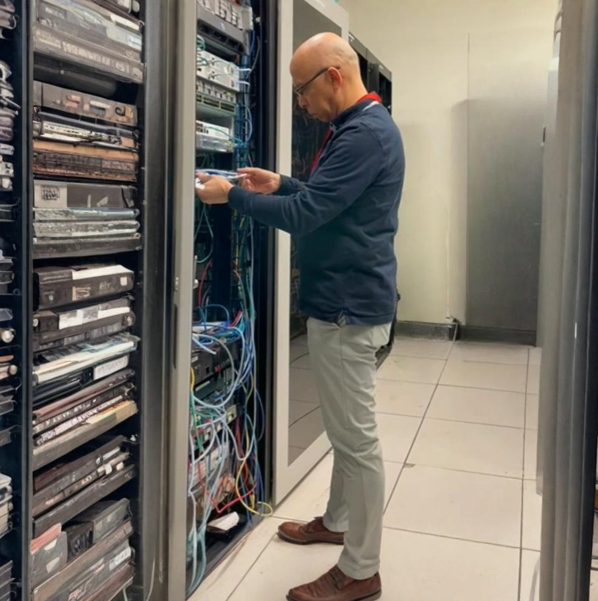

<h1 align="center">A Little About Me & Why I Do This</h1>

<h2 align="leftr">
BSc. Electronic engineer </h2>
<h3 align="leftr">
Senior Network Analyst | Cybersecurity Engineer | 
Telecommunications Specialist | Python Automation
</h3>

 
</img> 

  
So, what's my deal? I've got this personal mission, you could call it a challenge: to explain how cybersecurity works in plain English, or as I like to say, in <b><i>"muggle"</i></b> language. 
 
 
For over 12 years, I was a technical instructor for big corporate clients, and I can't even count the number of internal training sessions I ran for colleagues across Latin America. I’ve also had the privilege of being a university professor, teaching systems engineering to both undergrads and graduate students.
 
 
If there's one thing all those years have taught me, it's this: not everyone speaks <b><i>"geek."</i></b> And that's perfectly okay! My goal here, and with other stuff I create, is to cut through the dense technical jargon without losing the important stuff. I genuinely hope that if you're reading this, you feel a bit more confident and can speak up about why understanding cybersecurity is so deeply important these days. It’s not just for the IT crowd anymore; it’s for everyone.
 
 

→ Want to learn more or find some tools? Check out my stuff on GitHub

 
</img> 

